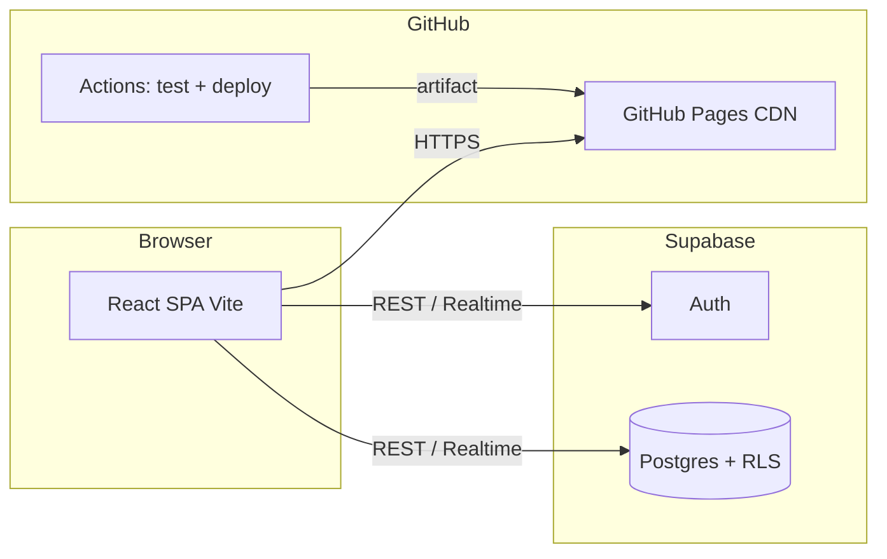

# TrueFlow — Architettura tecnica

Documento di riferimento per engineering e review incrociate. Allineato allo **stack M0** del repository, alla visione prodotto dell’epic board **NEW-1** (thread milestone Foundation su Paperclip) e ai documenti `docs/information-architecture-m0.md`, `docs/verified-sources.md`.

---

## Visione prodotto (sintesi)

Social orientato al **segui persone** (stile LinkedIn), con **tag e metatag** che definiscono feed verticali basati solo su **fonti certificate** — nessun feed “potrebbe piacerti” opaco. Dettaglio milestone e backlog: epic **NEW-1** (Paperclip).

---

## Stack (stato attuale)

| Layer               | Tecnologia                           | Note operative                                             |
| ------------------- | ------------------------------------ | ---------------------------------------------------------- |
| Frontend            | React 18, TypeScript, Vite 8         | SPA                                                        |
| Styling             | Tailwind CSS 4 (`@tailwindcss/vite`) | Token in `src/index.css` (`--tf-*`)                        |
| Routing             | `react-router-dom`                   | `BrowserRouter` in `main.tsx`; route in `App.tsx`          |
| Stato client        | Zustand                              | `src/store/useAppStore.ts`                                 |
| Backend             | Supabase                             | Auth, Postgres, RLS (migrazioni in `supabase/migrations/`) |
| Hosting statico     | GitHub Pages                         | `base: '/NEWS/'` in `vite.config.ts` (nome repo canonico)  |
| CI/CD               | GitHub Actions                       | `tests.yml` (lint + test), `deploy.yml` (build + Pages)    |
| Orchestrazione task | Paperclip                            | Issue, agenti, governance (fuori da questo repo)           |

**Opzionale / fasi successive (visione board):** worker RSS serverless (es. Cloudflare Workers o job schedulato GitHub Actions) per polling feed e popolamento `feed_items`; non è ancora implementato in M0.

---

## Diagramma logico (M0 → evoluzione)



In **M2+**, un **RSS poller** (servizio separato) scriverà su `verified_sources` / `feed_items` con credenziali server-side, non dall’anon key del browser.

---

## Struttura repository (effettiva)

```
trueflow/
├── .github/workflows/     # tests.yml, deploy.yml
├── docs/                    # architettura, fonti, IA, marketing (M0)
├── public/
├── src/
│   ├── components/ui/      # design system atomi
│   ├── layouts/            # AppLayout (shell)
│   ├── pages/              # Home, Feed, Profile, Explore, Settings
│   ├── lib/supabase.ts     # client browser
│   ├── store/
│   ├── App.tsx
│   └── main.tsx
├── supabase/migrations/    # schema + RLS
├── vite.config.ts
├── package.json
└── README.md
```

La board ha proposto anche `workers/rss-poller/` e `lib/rss.js` — da aggiungere quando il ticket RSS è in scope.

---

## Route e information architecture

| Path        | Pagina       | Scopo (M0+)                               |
| ----------- | ------------ | ----------------------------------------- |
| `/`         | Home         | Value proposition / onboarding            |
| `/feed`     | Feed         | Lettura item da fonti verificate + filtri |
| `/profile`  | Profilo      | Identità, tag, metatag, rete              |
| `/explore`  | Esplora      | Fonti e discovery curata                  |
| `/settings` | Impostazioni | Account, tema, preferenze                 |

Dettaglio UX/gerarchia: **`docs/information-architecture-m0.md`**.

**Base URL produzione:** con GitHub Pages il path pubblico include il segmento repository del deploy, es. `https://<org>.github.io/NEWS/` per tutt’e due i repo elencati in README; `base` Vite deve coincidere con quel segmento.

---

## Modello dati (Supabase)

Implementato nelle migrazioni `20260401000000_initial_schema.sql` e policy in `20260401000001_rls_policies.sql`.

| Tabella             | Ruolo                                          |
| ------------------- | ---------------------------------------------- |
| `profiles`          | Profilo 1:1 con `auth.users`                   |
| `follows`           | Relazione follower → followee                  |
| `user_tags`         | Tag verticali scelti dall’utente               |
| `user_metatags`     | Metatag utente                                 |
| `user_tag_metatags` | Associazione tag ↔ metatag                     |
| `verified_sources`  | Fonti RSS in whitelist curata                  |
| `feed_items`        | Articoli/item collegati a una fonte verificata |

Rispetto al modello concettuale della board (trust score, categoria, `verified_by`, matching tag su item), M0 ha uno **schema minimale**; le colonne aggiuntive e la logica di scoring vanno pianificate in milestone dedicate (es. M2–M5).

---

## Variabili d’ambiente (frontend)

- `VITE_SUPABASE_URL`
- `VITE_SUPABASE_ANON_KEY`

Per CI/deploy: configurare come **secrets** repository (vedi commenti in `deploy.yml`). In locale: copiare da `.env.example` se presente.

---

## CI/CD

1. **Tests** (`tests.yml`): su PR e push `main` — `npm ci`, `npm run lint`, `npm run test` (Vitest + jsdom).
2. **Deploy** (`deploy.yml`): su push `main` — build con eventuali secret Supabase, upload artifact, deploy ambiente `github-pages`.

Branch protection e convenzioni merge: **`docs/branch-protection.md`**.

---

## Decisioni e trade-off

- **GitHub Pages + SPA:** routing client-side richiede `404.html` o equivalente se si usano deep link diretti; verificare nel task QA deploy su GitHub Pages (es. issue **NEW-10**).
- **Solo fonti verificate in DB:** il client non deve poter inserire fonti arbitrarie senza policy; RLS e ruoli service per il poller RSS sono parte del hardening M2+.

---

## Riferimenti incrociati

- IA route M0: `docs/information-architecture-m0.md`
- Criteri ammissione fonti: `docs/verified-sources.md`
- Epic e milestone prodotto: issue **NEW-1** (Paperclip / board)
